# WebSocket Cart Operations with Customizations Flow

This diagram shows how cart operations (create, update, replace, delete) work with addons and variations through WebSocket connections.

```mermaid
sequenceDiagram
    participant FE as Frontend<br/>(CartDrawer/ItemCustomisations)
    participant CS as Cart Store<br/>(Zustand)
    participant WS as WebSocket Connection
    participant BE as Backend<br/>(session_ws.py)
    participant DB as Database<br/>(PostgreSQL)
    participant BC as Broadcast Manager
    participant OC as Other Clients

    Note over FE,OC: Cart Item Creation with Customizations

    FE->>CS: addItemToCart(menuItem, qty, note)
    Note over CS: Check if item has variations/addons
    alt Has customizations available
        CS->>FE: openCustomisation('add', menuItem, {qty, note, tmpId})
        FE->>FE: Show ItemCustomisations modal
        FE->>CS: User selects variations/addons
        CS->>CS: updateCustomisationData({selectedVariationId, selectedAddons})
        FE->>CS: confirmCustomisation()
    else No customizations
        CS->>CS: Direct add without modal
    end

    CS->>CS: addItemOptimistic(menuItem, qty, note, tmpId, selectedVariationId, selectedAddons)
    Note over CS: Optimistic update for immediate UI feedback

    CS->>WS: Send mutation message
    Note right of CS: {<br/>  op: 'create',<br/>  tmpId: 'abc123',<br/>  menu_item_id: 'item_456',<br/>  qty: 2,<br/>  note: 'Extra spicy',<br/>  selected_item_variation_id: 'var_789',<br/>  selected_addons: [<br/>    {addon_group_item_id: 'addon_1', quantity: 1},<br/>    {addon_group_item_id: 'addon_2', quantity: 2}<br/>  ]<br/>}

    WS->>BE: handle_cart_mutation(message)
    BE->>BE: handle_cart_create()
    
    BE->>DB: Validate menu_item exists
    DB-->>BE: MenuItem details
    
    alt Has selected_item_variation_id
        BE->>DB: Query ItemVariation
        Note right of BE: Validate variation belongs to menu item
        DB-->>BE: ItemVariation details
    end

    alt Has selected_addons
        loop For each addon
            BE->>DB: Query AddonGroupItem
            Note right of BE: Validate addon belongs to menu item
            DB-->>BE: AddonGroupItem details
            BE->>DB: Check ItemAddon link exists
            DB-->>BE: ItemAddon relationship
        end
    end

    BE->>DB: Create CartItem
    Note right of BE: {<br/>  public_id: 'ci_xyz789',<br/>  session_id: session.id,<br/>  member_id: member.id,<br/>  menu_item_id: menu_item.id,<br/>  selected_item_variation_id: variation.id,<br/>  qty: 2,<br/>  note: 'Extra spicy',<br/>  version: 1<br/>}

    alt Has selected addons
        loop For each addon
            BE->>DB: Create CartItemAddon
            Note right of BE: {<br/>  cart_item_id: cart_item.id,<br/>  addon_item_id: addon_item.id,<br/>  quantity: addon.quantity<br/>}
        end
    end

    BE->>BE: Calculate final_price
    Note right of BE: base_price + variation_price + (addon_price * quantity)

    BE->>BE: Build CartItemResponse with SelectedVariationResponse & SelectedAddonResponse
    
    DB-->>BE: Commit transaction
    
    BE->>BC: broadcast_to_session(CartUpdateEvent)
    Note right of BE: {<br/>  op: 'create',<br/>  item: {<br/>    public_id: 'ci_xyz789',<br/>    final_price: 450.00,<br/>    selected_variation: {<br/>      item_variation_id: 'var_789',<br/>      variation_name: 'Large',<br/>      group_name: 'Size',<br/>      price: 400.00<br/>    },<br/>    selected_addons: [<br/>      {<br/>        addon_group_item_id: 'addon_1',<br/>        name: 'Extra Cheese',<br/>        price: 25.00,<br/>        quantity: 1,<br/>        total_price: 25.00<br/>      }<br/>    ]<br/>  },<br/>  tmpId: 'abc123'<br/>}

    BC-->>WS: Send to all session members
    WS-->>CS: Receive CartUpdateEvent
    CS->>CS: applyCartUpdate(update)
    Note over CS: Replace optimistic item with server response
    CS-->>FE: State updated, UI re-renders

    BC-->>OC: Send to other clients
    OC->>OC: Update their local cart state

    Note over FE,OC: Cart Item Update Operation

    FE->>CS: updateCartItem(public_id, newQty, note, version)
    CS->>CS: updateItemOptimistic() - Optimistic update
    CS->>WS: Send update mutation
    Note right of CS: {<br/>  op: 'update',<br/>  public_id: 'ci_xyz789',<br/>  qty: 3,<br/>  note: 'Make it very spicy',<br/>  version: 1<br/>}

    WS->>BE: handle_cart_update()
    BE->>DB: Query existing CartItem + variations + addons
    BE->>BE: Validate version, permissions, state
    BE->>DB: Update CartItem.qty, CartItem.note, CartItem.version++
    
    BE->>DB: Read current ItemVariation (if any)
    DB-->>BE: ItemVariation details
    
    BE->>DB: Read current CartItemAddon records
    DB-->>BE: CartItemAddon + AddonGroupItem details
    
    BE->>BE: Calculate updated final_price
    BE->>BE: Build responses with current selections
    
    BE->>BC: broadcast_to_session(CartUpdateEvent)
    Note right of BE: {<br/>  op: 'update',<br/>  item: {<br/>    public_id: 'ci_xyz789',<br/>    qty: 3,<br/>    note: 'Make it very spicy',<br/>    version: 2,<br/>    final_price: 450.00,<br/>    selected_variation: {...},<br/>    selected_addons: [...]<br/>  }<br/>}

    BC-->>WS: Update all clients
    WS-->>CS: Update local state
    CS-->>FE: Re-render with new data

    Note over FE,OC: Cart Item Replace Operation (Change Customizations)

    FE->>CS: replaceCartItem(cartItemId, newMenuItem, qty, note)
    CS->>CS: Check if new item has customizations
    alt Has customizations
        CS->>FE: openCustomisation('replace', newMenuItem, existing_data)
        FE->>FE: Show modal with current selections pre-filled
        FE->>CS: User modifies selections
        FE->>CS: confirmCustomisation()
    end

    CS->>CS: replaceItemOptimistic() - Optimistic update
    CS->>WS: Send replace mutation
    Note right of CS: {<br/>  op: 'replace',<br/>  public_id: 'ci_xyz789',<br/>  menu_item_id: 'item_999',<br/>  qty: 2,<br/>  note: 'No onions',<br/>  version: 2,<br/>  selected_item_variation_id: 'var_555',<br/>  selected_addons: [<br/>    {addon_group_item_id: 'addon_3', quantity: 1}<br/>  ]<br/>}

    WS->>BE: handle_cart_replace()
    BE->>BE: Validate existing cart item
    BE->>BE: Validate new menu item + variations + addons
    
    BE->>DB: Update CartItem with new values
    BE->>DB: Delete existing CartItemAddon records
    BE->>DB: Create new CartItemAddon records
    
    BE->>BE: Calculate new final_price
    BE->>BE: Build updated responses
    
    BE->>BC: broadcast_to_session(CartUpdateEvent)
    Note right of BE: {<br/>  op: 'update',<br/>  item: {<br/>    public_id: 'ci_xyz789', // Same cart item ID<br/>    menu_item_pid: 'item_999', // New menu item<br/>    final_price: 380.00, // Recalculated<br/>    version: 3, // Incremented<br/>    selected_variation: {new_variation_data},<br/>    selected_addons: [new_addon_data]<br/>  }<br/>}

    BC-->>WS: Update all clients
    WS-->>CS: Apply cart update
    CS-->>FE: Re-render with replaced item

    Note over FE,OC: Error Handling & Version Conflicts

    alt Version Conflict
        BE->>BC: Send CartErrorEvent
        Note right of BE: {<br/>  code: 'version_conflict',<br/>  detail: 'Item version is 3, not 2',<br/>  currentItem: {current_cart_item_data}<br/>}
        BC-->>WS: Send error to client
        WS-->>CS: handleCartError()
        CS->>CS: Revert optimistic changes
        CS-->>FE: Show conflict resolution UI
    end

    alt Permission Error
        BE->>BC: Send error (not_authorised)
        BC-->>WS: Send error to client
        WS-->>CS: Revert optimistic changes
        CS-->>FE: Show permission error
    end

    Note over FE,OC: Real-time Synchronization Benefits

    Note over CS: • Optimistic updates for instant UI feedback<br/>• Server validation ensures data integrity<br/>• Broadcast keeps all clients synchronized<br/>• Version control prevents concurrent conflicts<br/>• Rich customization data preserved throughout flow
```

## Key Features:

### 1. **Optimistic Updates**
- Frontend immediately updates UI for better UX
- Server validates and broadcasts authoritative state
- Conflicts resolved with version control

### 2. **Customization Handling**
- Frontend checks if items have variations/addons available
- Modal opens for customization selection
- All customization data preserved in cart operations

### 3. **Price Calculation**
- Backend calculates final price including:
  - Base menu item price
  - Selected variation price (absolute)
  - Selected addons (quantity × price)

### 4. **Data Validation**
- Menu item existence validation
- Variation belongs to menu item
- Addon groups linked to menu item via ItemAddon
- Permission checks for edit operations

### 5. **Real-time Sync**
- All session members see updates instantly
- State consistency across all connected clients
- Error handling with graceful fallbacks
