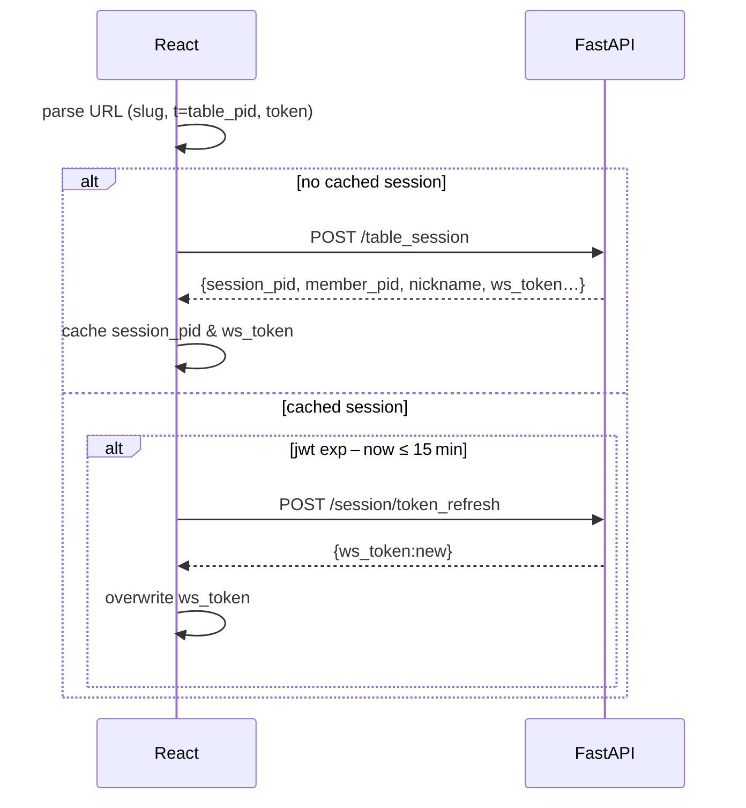

# Front‑End Playbook — Table Session & WebSocket  
*(React PWA, matching `table_session_api_and_ws.md`)*  

---

## 0. Local storage keys

| Key | Scope | Purpose |
|-----|-------|---------|
| `device_id` | **localStorage** | Stays forever; unique per browser. |
| `session_pid` | **sessionStorage** | Cleared on tab close. |
| `ws_token` | **sessionStorage** | JWT for WS/Auth; refreshed every ≤3 h. |

Generate `device_id` once:

```ts
export const getDeviceId = () => {
  let id = localStorage.getItem("device_id");
  if (!id) {
    id = crypto.randomUUID();
    localStorage.setItem("device_id", id);
  }
  return id;
};
```

---

## 1. First load after scanning the QR



### useTableSession hook

```ts
export const useTableSession = () => {
  const [ctx, setCtx] = useState<SessionCtx | null>(null);

  useEffect(() => {
    const url = new URL(location.href);
    const table_pid = url.searchParams.get("t");
    const token     = url.searchParams.get("token");
    const device_id = getDeviceId();

    const cachedSid = sessionStorage.getItem("session_pid");
    const cachedJwt = sessionStorage.getItem("ws_token");

    async function boot() {
      if (!cachedSid || !cachedJwt) {
        const r = await api.post("/table_session", { table_pid, token, device_id });
        sessionStorage.setItem("session_pid", r.session_pid);
        sessionStorage.setItem("ws_token",  r.ws_token);
        setCtx(r);
      } else {
        const freshJwt = await maybeRefreshToken(cachedJwt);
        setCtx({ session_pid: cachedSid, ws_token: freshJwt });
      }
    }
    boot();
  }, []);

  return ctx;         // null until ready
};
```

---

## 2. WebSocket management

### useSessionSocket hook

```ts
export function useSessionSocket(
  sid: string | undefined,
  token: string | undefined,
  handler: (evt: WsEvt) => void
) {
  useEffect(() => {
    if (!sid || !token) return;
    let ws: WebSocket;

    function connect() {
      ws = new WebSocket(`${import.meta.env.VITE_WS_BASE}/ws/session?sid=${sid}`);
      ws.onopen = () => ws.send("ping");
      ws.onmessage = e => handler(JSON.parse(e.data));
      ws.onclose = e => {
        if (e.code === 4003) {          // auth
          maybeRefreshToken(token).then(connect);
        } else {
          setTimeout(connect, 2000);    // back‑off
        }
      };
      ws.onerror = () => ws.close();
      (ws as any).protocol = `Bearer ${token}`; // some libs use this
    }
    connect();
    return () => ws.close();
  }, [sid, token]);
}
```

---

## 3. Nickname rename flow

1. User clicks nickname → modal input.  
2. `PATCH /member/{member_pid}` `{nickname:"Alex"}`.  
3. Server returns `200`; broadcasts `member_join` with updated nick.  
4. Local state updates via WS handler.

---

## 4. JWT refresh helper

```ts
async function maybeRefreshToken(jwt: string): Promise<string> {
  const { exp } = JSON.parse(atob(jwt.split(".")[1]));
  if (exp * 1000 - Date.now() > 15 * 60 * 1000) return jwt;

  const r = await api.post("/session/token_refresh", null, {
    headers: { Authorization: `Bearer ${jwt}` }
  });
  sessionStorage.setItem("ws_token", r.ws_token);
  return r.ws_token;
}
```

---

## 5. UI error handling

| Close / Code | UX action |
|--------------|-----------|
| WS close 4003 | Call `maybeRefreshToken` → reconnect; toast “Session renewed.” |
| WS close 4008 | Show modal: “Too many open tabs. Close one and refresh.” |
| HTTP 423 `restaurant_closed` | Full‑screen banner: “We’re closed now. Opening at 08 : 00.” |

---

## 6. Component wiring example

```tsx
const App = () => {
  const sess = useTableSession();
  const [members, setMembers] = useState<Member[]>([]);

  useSessionSocket(sess?.session_pid, sess?.ws_token, evt => {
    if (evt.type === "member_join") {
      setMembers(ms => [...ms.filter(m=>m.member_pid!==evt.member.member_pid), evt.member]);
    }
    if (evt.type === "error") toast(evt.code);
  });

  if (!sess) return <Splash/>;
  return <MenuPage context={sess} members={members}/>
}
```

---

## 7. Checklist summary

1. **Parse URL** → call `/table_session` unless cached.  
2. Save `session_pid`, `ws_token` in `sessionStorage`.  
3. Open WebSocket (`/ws/session`) with token; auto‑reconnect.  
4. Handle `member_join` and `error` events.  
5. Provide rename UI via `PATCH /member/{id}`.  
6. Refresh JWT when <15 min TTL; restart socket with new token.

This file is a ready‑to‑implement blueprint for the React PWA layer matching the current back‑end contract.
